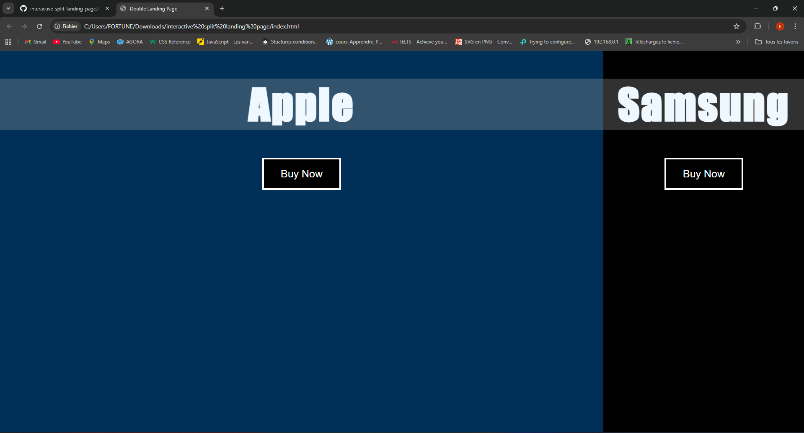
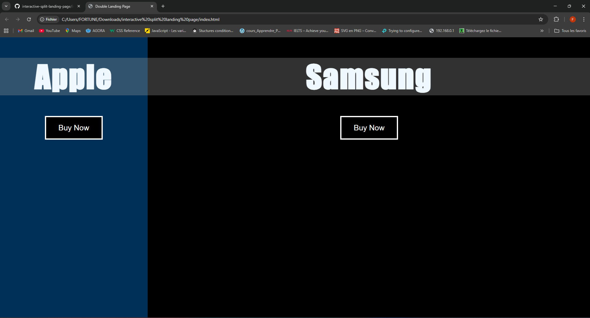
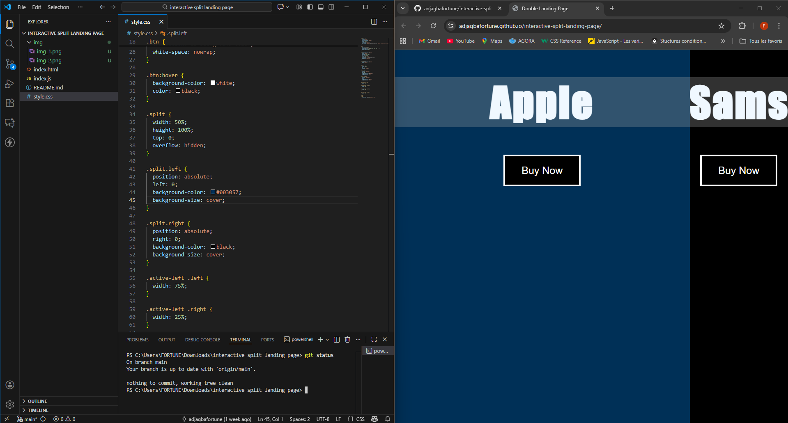

  
  
  

- index.html : Establishes the core HTML structure for the dual-panel layout, ensuring semantic separation of content.  

- style.css : Implements the full-screen layout (100vh) using Flexbox and utilizes complex CSS transitions (2s ease-in-out) to create the smooth expansion animation based on user interaction.  

- index.js : Manages all DOM event listeners (mouseenter and mouseleave) to dynamically apply CSS classes that trigger the visual split and expansion effect.

## Live Demo

Check out the demo here :

